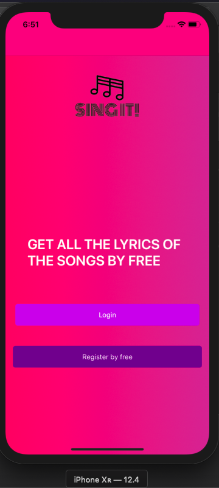
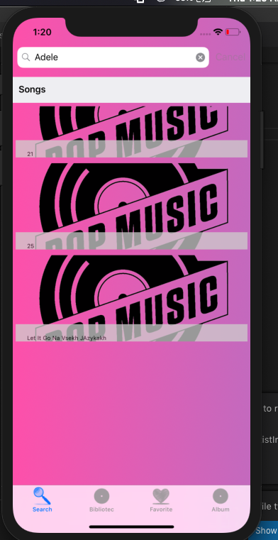
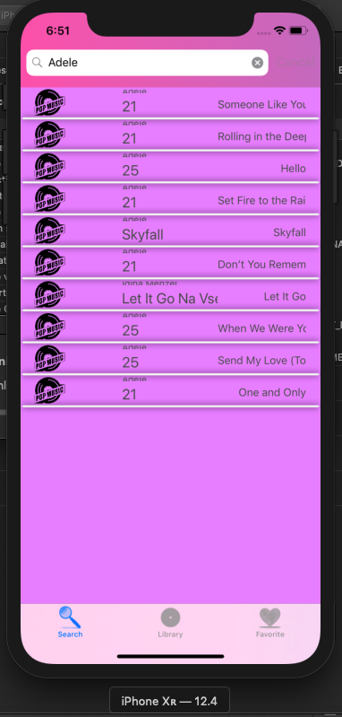
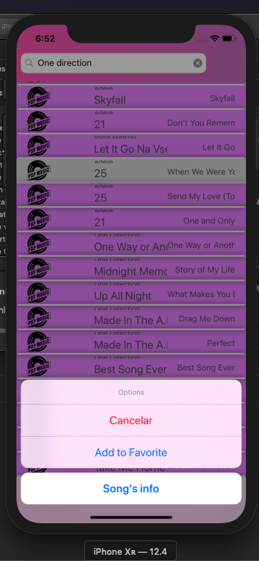

# SingIT
# SingIT
This is the Final Project

Sing it!

Musixmatch es un catálogo de letras con más de 12.4 millones de letras en 50 idiomas. 

Nuestra aplicacion se llama Sing it, La principal funcion de nuestra aplicacion es buscar la Lyrics de las canciones, aparte de eso, podemos buscar una cancion y ver el artista y el rating. 
El usuario debe logearse para poder empezar, una vez que lo hace puede realizar una busqueda, Agregar a favorita y ver informacion del album.

TeamMembers:

Perla Darianny Moreno 1072483

Adrian 

Las librerias Utilizadas fueron:

Packages used:
acr.UserDialogs
fusillade
modernhttpclient
NETStandard.Library
Polly
Prism.Unity.Forms
PropertyChanged.Fody
Refit
SQLiteNetExpressions.Async
Xam.Plugin.Connectivity
Xamarin.Forms
Xamarin.Essentials

Link de nuestro Trello:

https://trello.com/b/fNwYrM72/sing-it-app

Link de nuestro Mockup:

(https://drive.google.com/file/d/17wrr4xoBDVKeTP8CXJKUlgMAOFH3dCtB/view?usp=sharing)

 

  
 

  

  
 

  

  
 

  

  
 

  

  
 

   

  
 

   

  
 

   

  
 

